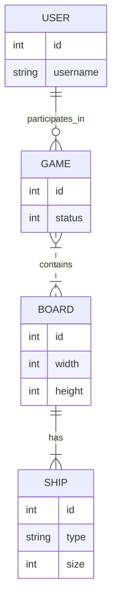
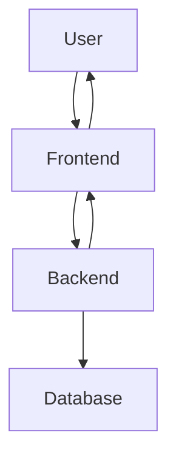

# 🚀 Space BattleShip

Space BattleShip is a learning project designed to explore both frontend and backend development, as well as API integration. The final goal is to use this game as a platform to test and compare the abilities of different AI agents in a competitive environment. 🧠🤖

---

## 🎯 Project Goals

- 🧩 **Fullstack Learning:** Strengthen skills in both frontend and backend technologies.
- 🔗 **API Integration:** Practice API design and consumption.
- 🤖 **AI Competition:** Build an arena for AI agents to play Battleship against each other.

---

## ✨ Features

- 🕹️ Classic Battleship gameplay
- 🖥️ Frontend & Backend communication
- 📡 RESTful API-driven logic
- 🧱 Modular structure for easy extension and experimentation

---

## 🛠️ Tech Stack

- **Frontend:** (e.g. React, Vue, or Vanilla JS)
- **Backend:** (e.g. FastAPI, Node.js, or Flask)
- **API:** RESTful endpoints for game and agent integration
- **AI/ML:** (Planned) Plug-in interfaces for AI agents

---

## 🏁 Getting Started

### Prerequisites

- Node.js and npm (or relevant stack dependencies)
- (Optional) Python or backend-specific dependencies

### Installation

```bash
git clone https://github.com/FilipePacheco73/Space-BattleShip.git
cd Space-BattleShip
# Install backend and frontend dependencies as required
```

### Running the Project

1. **Backend:**  
   Run the backend server (e.g., `npm run start` or `uvicorn app.main:app --reload`).

2. **Frontend:**  
   Start the frontend (e.g., `npm run dev`).

3. **Access:**  
   Open your browser at `http://localhost:3000` (or relevant port).

---

## 🗂️ Project Structure

```
/Space-BattleShip
│
├── backend/         # Backend code
├── frontend/        # Frontend code
├── api/             # API routes and controllers
├── ai_agents/       # (Planned) AI agents
└── README.md
```

---

## 🗺️ Flowcharts

### 📉 Data Model Flowchart



### 🔄 Project Flow (Current Functionality)



---

## 🏆 Roadmap

- [x] Core Battleship game logic
- [x] Basic frontend & backend integration
- [ ] Refined API endpoints
- [ ] AI agent interface & integration
- [ ] AI vs AI matches with analytics
- [ ] User authentication & multiplayer

---

## 📈 Project Evolution

### 🚩 Commits and Pull Requests Overview

- **Initial Commit:** Set up repo structure and created the base database. ([commit](https://github.com/FilipePacheco73/Space-BattleShip/commit/55086e328bb17ac6666355630cf48999b285560a), [commit](https://github.com/FilipePacheco73/Space-BattleShip/commit/046b85bd0c4a09abf6a9559da87670acd911d5cc))
- **Data Initialization:** Refactored data loading, introducing FastAPI endpoints and Pydantic schemas. ([commit](https://github.com/FilipePacheco73/Space-BattleShip/commit/ef72eb7f17255a4d7c11dcf049aa7d58c5915cd6))
- **API Data Management:** Added core API endpoints for dynamic data management (users/ships), enabled database CRUD. ([PR #1](https://github.com/FilipePacheco73/Space-BattleShip/pull/1), merged on 2025-06-05)
- **Path Adjustments:** Improved import paths for libraries. ([commit](https://github.com/FilipePacheco73/Space-BattleShip/commit/56163deaaa30cda56801a7492ec4d2f5f41b6987))
- **Database Schema Update:** Updated DB schema, added seeding for ships and users. ([commit](https://github.com/FilipePacheco73/Space-BattleShip/commit/bd1f7d068356c0f7e93e6c99931a570cb195dff7))

### 📝 Summary

- The project began with the foundational setup and quickly moved to implement backend APIs and data models.
- Early commits focused on structuring data management and CRUD operations for users and ships.
- The first PR formalized the connection between API and data, supporting dynamic scenarios for future AI agent integration.
- Current focus is on refining APIs, improving the data flow, and preparing for AI agent battles.

---

## 🤝 Contributing

Contributions are welcome! Open issues or submit pull requests to help grow the project.

## 📜 License

MIT License

## 👤 Author

[FilipePacheco73](https://github.com/FilipePacheco73)

---

*This project is a playground for exploring fullstack development and artificial intelligence in a fun, competitive setting!*
