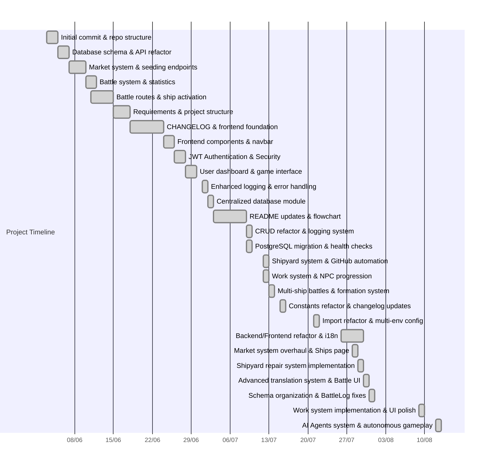

# 🚀 Bellum Astrum

**Current Version: 0.5.8** | **[🌐 Live Demo](https://bellum-astrum-prod.onrender.com/)**

## 🎮 About the Game

Bellum Astrum is a strategic spaceship battle game where players command fleets, engage in tactical combat, and progress through military ranks. Set in a futuristic space environment, players can:

- **Battle System**: Engage in strategic combat against NPCs or other players with complex battle mechanics
- **Fleet Management**: Buy, sell, repair, and customize spaceships with different stats and capabilities
- **Progression**: Advance through 11 military ranks (Recruit to Fleet Admiral) with rank-based bonuses
- **Economy**: Participate in a dynamic economy with ship trading and work-based income recovery
- **Work System**: Earn credits through various work types based on your military rank
- **Multiplayer**: Challenge other players in PvP battles with ELO ranking system
- **AI Competition**: Watch autonomous AI agents compete 24/7 with learning capabilities

## 🎯 Project Goals

Bellum Astrum serves as a comprehensive learning project with multiple educational objectives:

- 🧩 **Backend Development**: Master FastAPI, SQLAlchemy, and Pydantic in a real-world application
- 🏗️ **System Architecture**: Learn to design scalable, modular backend systems
- 🗄️ **Database Design**: Practice complex database relationships and data modeling
- 🔗 **RESTful APIs**: Build comprehensive API endpoints for game resources
- 🎨 **Frontend Integration**: Create modern React-based user interfaces with TypeScript
- 🌍 **Internationalization**: Implement complete multi-language support (PT-BR/EN-US)
- 🧪 **Testing**: Develop comprehensive test suites and automation
- 🤖 **AI Agents**: Build autonomous players with LLM-based decision making and strategic learning
- 🧠 **Machine Learning**: Explore AI behavior patterns, file-based memory systems, and adaptive strategies
- 📊 **Data Analytics**: Track performance metrics and user progression statistics

## 🛠️ Tech Stack

### Backend & Infrastructure
- **Backend:** Python 3.12+, FastAPI, SQLAlchemy, Pydantic
- **Database:** PostgreSQL with centralized management module
- **Authentication:** JWT with bcrypt password hashing and secure session management
- **Testing:** Pytest with comprehensive end-to-end coverage

### Frontend & User Experience  
- **Frontend:** React 19, TypeScript, Vite, Tailwind CSS v3
- **State Management:** Custom hooks and context providers
- **Internationalization:** Advanced translation system with parameter interpolation
- **UI/UX:** Responsive design with real-time updates and loading states

### AI & Intelligence
- **AI Framework:** Local LLMs via HuggingFace Transformers (DialoGPT, Mistral 7B, TinyLlama)
- **Decision Engine:** Strategic prompts with personality-based behavior patterns
- **Memory System:** File-based learning with JSON Lines format for agent persistence
- **Logging:** Dual logging system (debug + AI decisions) for comprehensive monitoring

### DevOps & Deployment
- **Deployment:** Automated GitHub release workflow with version management
- **Environment:** Multi-environment configuration (development, production)
- **Monitoring:** Advanced logging systems for both application and AI agent activities

## 📚 Documentation

For detailed information about each component of the project, please refer to the specific documentation:

- 📖 **[Backend Documentation](backend/README.md)** - FastAPI setup, routes, business logic, and API endpoints
- 🗄️ **[Database Documentation](database/README.md)** - Database schema, models, setup, and management tools
- 🎨 **[Frontend Documentation](frontend/README.md)** - React application, components, styling, and user interface
- 🤖 **[AI Agents Documentation](AI_Agents/README.md)** - Autonomous AI players, match system, and intelligence architecture

## 🚀 Quick Start

To get started with Bellum Astrum, follow these basic steps:

1. **Clone and Setup**: Clone the repository and set up your Python virtual environment
2. **Database Configuration**: Set up PostgreSQL and configure environment variables
3. **Backend Setup**: Install Python dependencies and start the FastAPI server
4. **Frontend Setup**: Install Node.js dependencies and start the React development server
5. **AI Agents Setup** (Optional): Configure AI agents for autonomous gameplay
6. **Play**: Register an account and start battling (or watch AI agents compete)!

For detailed setup instructions, please refer to the component-specific documentation linked above.

## 🎮 Game Features

- ⚔️ **Strategic Combat**: Engage in tactical battles with complex damage calculations
- 🚀 **Fleet Management**: Build and customize your spaceship fleet
- 🏆 **Ranking System**: Progress through 11 military ranks with stat bonuses
- 💰 **Dynamic Economy**: Trade ships and earn credits through various activities
- 🤖 **AI Opponents**: Battle against balanced NPC opponents
- 👥 **Multiplayer**: Challenge other players with ELO rating system
- 🌍 **Multi-language**: Full support for Portuguese and English
- 📊 **Statistics**: Track your progress with detailed battle and progression stats
- 🤖 **AI Agents**: Autonomous AI players that compete 24/7 with learning capabilities

---

## 🗂️ Project Structure

```
/Bellum-Astrum
│
├── backend/          # FastAPI backend application
├── database/         # Centralized database module  
├── frontend/         # React frontend application
├── AI_Agents/        # Autonomous AI players system
├── requirements.txt  # Python dependencies
├── CHANGELOG.md      # Version history
└── README.md         # This file
```


## 📊 Project Timeline



## 🤝 Contributing

Contributions are welcome! Open issues or submit pull requests to collaborate.

## 📜 License

MIT License

## 👤 Author

[FilipePacheco73](https://github.com/FilipePacheco73)

---

*This project is a playground for exploring backend, APIs, and artificial intelligence in a fun, competitive setting!*

---