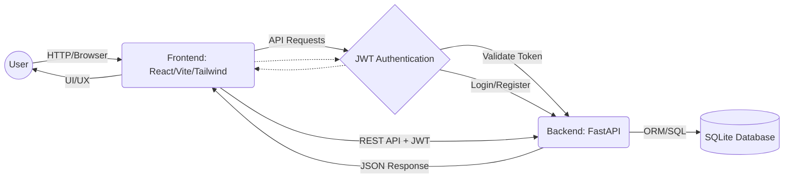
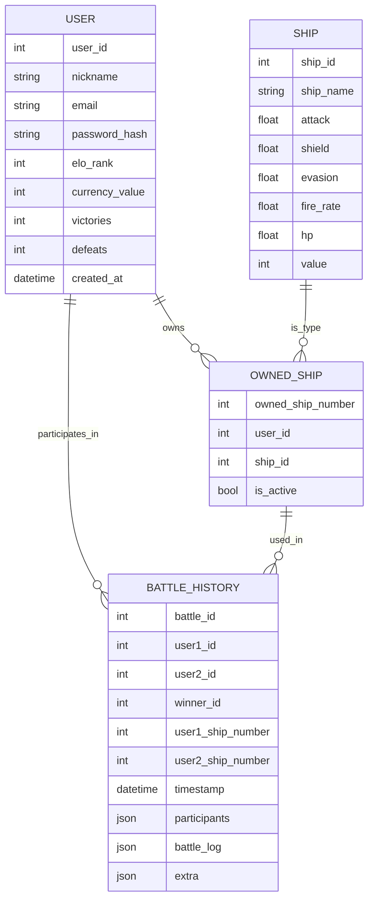
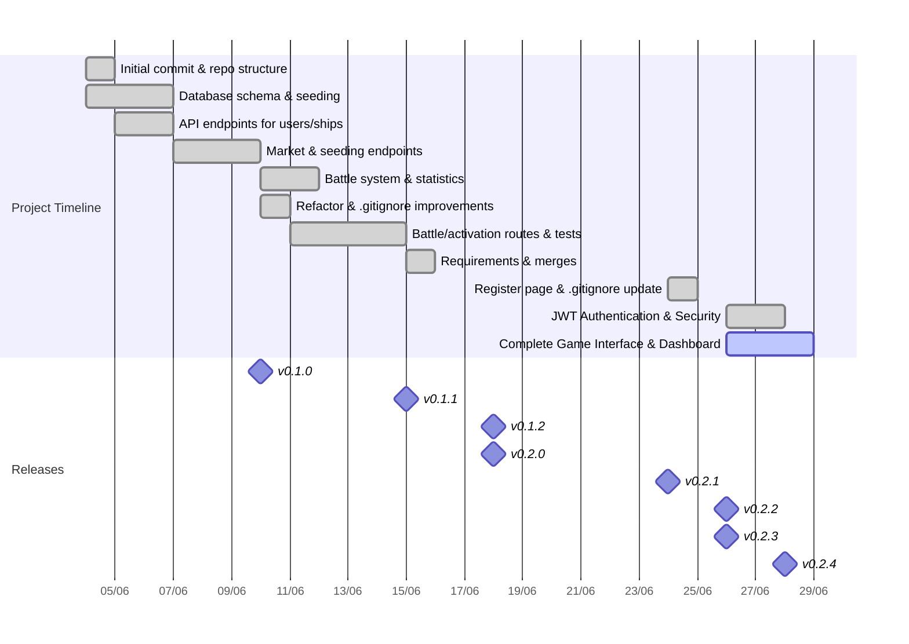

# 🚀 Bellum Astrum

Bellum Astrum (formerly Space BattleShip) is a learning project focused on backend development with FastAPI, SQLite database, and spaceship battle logic. The project is now organized to facilitate expansion with a modern frontend.

---

## 🎯 Project Goals

- 🧩 **Backend Learning:** Practice with FastAPI, SQLAlchemy, and Pydantic.
- 🔗 **RESTful API:** Endpoints for game resources.
- 🤖 **AI-Ready Base:** Structure ready for intelligent agents and frontend integration.

---

## ✨ Features

- 🕹️ CRUD for users and ships
- ⚔️ Battle system with ship activation
- 🛒 Ship market (buy/sell)
- 🌱 Data seeding endpoints
- 📡 Modular and extensible REST API
- 🖥️ Modern web interface (React + Vite + Tailwind)
- 🔐 JWT-based authentication system
- 🌍 Multi-language support (Portuguese/English)
- 🎮 Complete game interface with sidebar navigation
- 📊 User dashboard with statistics and ELO ranking

---

## 🛠️ Tech Stack

- **Backend:** Python 3.12+, FastAPI, SQLAlchemy, Pydantic
- **Database:** SQLite
- **Authentication:** JWT with bcrypt password hashing
- **Testing:** Pytest, FastAPI TestClient
- **Frontend:** React 19, Vite, TypeScript, Tailwind CSS v3
- **API Client:** Axios with automatic token injection
- **Internationalization:** Custom translation system (PT-BR/EN-US)
- **Structure:** Backend in `backend/app/`, Frontend in `frontend/`

---

## 🏁 Getting Started

### Prerequisites

- Python 3.12+
- Node.js 18+
- (Recommended) Virtual environment: `python -m venv venv`

### Backend Installation

```bash
# Clone the repository
git clone https://github.com/FilipePacheco73/Bellum-Astrum.git
cd Bellum-Astrum
# Create and activate a virtual environment
python -m venv venv
# On Windows:
venv\Scripts\activate
# Install backend dependencies
pip install -r requirements.txt
```

### Running the Backend API

```bash
uvicorn backend.app.main:app --reload
```

Access the interactive documentation at: [http://localhost:8000/docs](http://localhost:8000/docs)

### Frontend Installation

```bash
cd frontend
npm install
```

### Running the Frontend

```bash
npm run dev
```

Access the web interface at: [http://localhost:5173](http://localhost:5173)

---

## 🗂️ Project Structure

```
/Bellum-Astrum
│
├── backend/
│   ├── app/
│   │   ├── main.py           # FastAPI entry point
│   │   ├── schemas.py        # Pydantic schemas
│   │   ├── crud/             # CRUD operations
│   │   ├── database/         # Database config and models
│   │   ├── routes/           # API routes/endpoints
│   │   └── test/             # Automated tests
│   └── requirements.txt      # Python dependencies
│
├── frontend/
│   ├── src/                  # React source code
│   │   ├── components/       # Reusable React components (Navbar, GameLayout, Sidebar, etc.)
│   │   ├── pages/            # Main pages/routes (Home, Dashboard, Register, Market, etc.)
│   │   ├── contexts/         # React context providers (AuthContext, LanguageContext, SidebarContext)
│   │   ├── locales/          # Localization and translations (PT-BR/EN-US)
│   │   ├── config/           # API configuration and types
│   │   ├── assets/           # Static assets (images, icons)
│   │   ├── App.tsx           # Main App component
│   │   ├── main.tsx          # React entry point
│   │   └── ...               # Other configs and styles
│   ├── public/               # Static assets (logos, backgrounds, flags)
│   ├── package.json          # Frontend dependencies
│   └── ...                   # Vite, Tailwind, config files
│
├── README.md
└── CHANGELOG.md
```

---

## 🗺️ Project Flowchart



---

## 🗺️ Data Model Flowchart



---

## 🧩 Main Endpoints

### Authentication
- `POST /api/v1/users/register` – Register new user with email and password
- `POST /api/v1/users/login` – Login user and receive JWT token

### Data Management
- `POST /api/v1/seed/users` – Seed the database with initial users
- `POST /api/v1/seed/ships` – Seed the database with initial ships
- `POST /api/v1/seed/npc-ships` – Assign ships to NPCs based on ELO

### Game Resources
- `GET /api/v1/users/` – List all users
- `GET /api/v1/users/{user_id}` – Get specific user details
- `GET /api/v1/ships/` – List all ships
- `GET /api/v1/ships/{ship_id}` – Get specific ship details

### Market System
- `POST /api/v1/market/buy/{user_id}/{ship_id}` – User buys a ship
- `POST /api/v1/market/sell/{user_id}/{owned_ship_number}` – User sells a ship

### Battle System
- `POST /api/v1/battle/activate-ship/` – Activate a ship for battle
- `POST /api/v1/battle/battle` – Battle between two users

See the Swagger documentation for payload and response details.

---

## 🏆 Roadmap

- [x] CRUD for users and ships
- [x] Data seeding endpoints
- [x] Battle system with ship activation
- [x] Ship market (buy/sell)
- [x] Backend reorganization to `backend/app/`
- [x] Modern frontend (React 19, Vite, TypeScript)
- [x] JWT-based authentication system
- [x] Password hashing and security
- [x] Internationalization (i18n) for frontend (PT-BR/EN-US)
- [x] Complete game interface with sidebar navigation
- [x] User dashboard with ELO ranking and statistics
- [x] Enhanced UI components and layouts
- [ ] User profile and settings page
- [ ] Responsive/mobile-friendly frontend
- [ ] Real-time multiplayer features
- [ ] Enhanced battle system with animations
- [ ] Ship customization and upgrades
- [ ] Leaderboards and tournaments
- [ ] API documentation improvements (OpenAPI, examples)
- [ ] Enhanced error handling and user feedback
- [ ] CI/CD pipeline (tests, lint, deploy)
- [ ] Docker support (dev/prod)
- [ ] Admin dashboard for managing users/ships
- [ ] Unit and integration tests for frontend
- [ ] Interface for AI agents

---

## 📊 Timeline (Commit History)



- Each bar represents a key phase or feature, based on actual commit dates and messages.
- For full commit details, see the [GitHub commit history](https://github.com/FilipePacheco73/Bellum-Astrum/commits/main).

---

## 🤝 Contributing

Contributions are welcome! Open issues or submit pull requests to collaborate.

## 📜 License

MIT License

## 👤 Author

[FilipePacheco73](https://github.com/FilipePacheco73)

---

*This project is a playground for exploring backend, APIs, and artificial intelligence in a fun, competitive setting!*