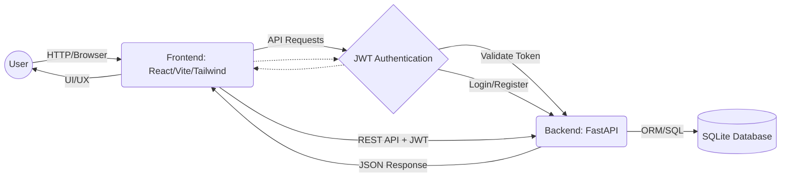
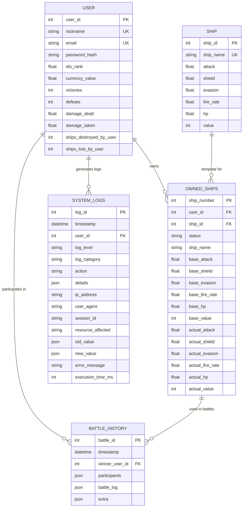
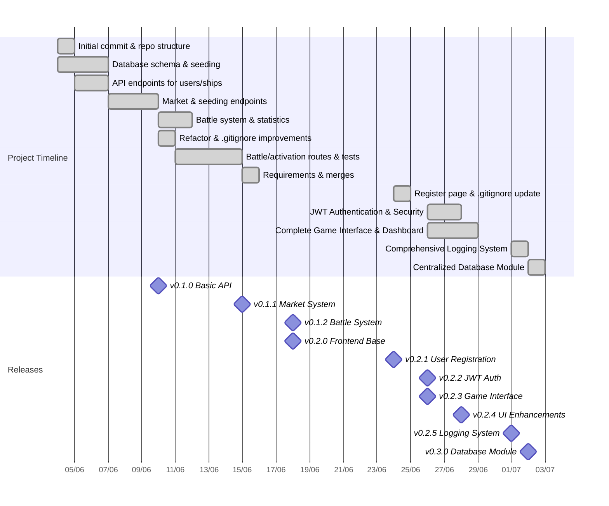

# 🚀 Bellum Astrum

Bellum Astrum (formerly Space BattleShip) is a learning project focused on backend development with FastAPI, SQLite database, and spaceship battle logic. The project is now organized to facilitate expansion with a modern frontend.

---

## 🎯 Project Goals

- 🧩 **Backend Learning:** Practice with FastAPI, SQLAlchemy, and Pydantic.
- 🔗 **RESTful API:** Endpoints for game resources.
- 🤖 **AI-Ready Base:** Structure ready for intelligent agents and frontend integration.

---

## ✨ Features

- 🕹️ CRUD for users and ships
- ⚔️ Battle system with ship activation
- 🛒 Ship market (buy/sell)
- 🌱 Data seeding endpoints
- 📡 Modular and extensible REST API
- 🖥️ Modern web interface (React + Vite + Tailwind)
- 🔐 JWT-based authentication system
- 🌍 Multi-language support (Portuguese/English)
- 🎮 Complete game interface with sidebar navigation
- 📊 User dashboard with statistics and ELO ranking
- 🗄️ **Centralized Database Module**: Organized database management with lifecycle controls
- 📝 **Comprehensive Logging**: System audit trails and monitoring
- 🔧 **Database Scripts**: Command-line tools for database management

---

## 🛠️ Tech Stack

- **Backend:** Python 3.12+, FastAPI, SQLAlchemy, Pydantic
- **Database:** SQLite with comprehensive schema and constraints
- **Authentication:** JWT with bcrypt password hashing
- **Testing:** Pytest, FastAPI TestClient
- **Frontend:** React 19, Vite, TypeScript, Tailwind CSS v3
- **API Client:** Axios with automatic token injection
- **Internationalization:** Custom translation system (PT-BR/EN-US)
- **Structure:** Backend in `backend/app/`, Frontend in `frontend/`, Database in `database/`

---

## 🏗️ Database Architecture

The project features a centralized database module with clean imports and lifecycle management:

### Database Structure
```
database/
├── __init__.py           # Clean exports for easy imports
├── config.py             # Database configuration and engine setup
├── session.py            # Session management and dependency injection
├── models.py             # SQLAlchemy models (User, Ship, OwnedShips, etc.)
├── base_data.py          # Initial data for seeding
├── lifecycle.py          # Database initialization and health checks
├── setup.py              # Main command-line setup script
└── scripts/              # Quick utility scripts
    ├── init_db.py        # Quick initialization
    ├── seed_db.py        # Quick seeding
    └── reset_db.py       # Quick reset
```

### Database Models
- **User**: Game user accounts with ELO ranking and statistics
- **Ship**: Ship templates with base characteristics
- **OwnedShips**: Individual ships owned by users with current stats
- **BattleHistory**: Records of battles with detailed logs
- **SystemLogs**: Comprehensive audit logging for security and debugging

### Database Management
```bash
# Initialize database with sample data
python database/setup.py init --seed

# Add sample data to existing database  
python database/setup.py seed

# Reset database (drop + recreate)
python database/setup.py reset --seed

# Clear all data (keep structure)
python database/setup.py clear

# Check database health
python database/setup.py health
```

### Clean Imports
```python
# Simple imports for common use cases
from database import get_db, User, Ship, OwnedShips
from database import initialize_database, check_database_health

# All database functionality accessible through clean interface
```

---

## 🏁 Getting Started

### Prerequisites

- Python 3.12+
- Node.js 18+
- (Recommended) Virtual environment: `python -m venv venv`

### Quick Start

```bash
# Clone the repository
git clone https://github.com/FilipePacheco73/Bellum-Astrum.git
cd Bellum-Astrum

# Create and activate virtual environment
python -m venv venv
# On Windows:
venv\Scripts\activate
# On Linux/macOS:
# source venv/bin/activate

# Install dependencies
pip install -r requirements.txt

# Initialize database with sample data
python database/setup.py init --seed

# Start the API server
uvicorn backend.app.main:app --reload
```

The API will be available at: [http://localhost:8000](http://localhost:8000)  
Interactive docs at: [http://localhost:8000/docs](http://localhost:8000/docs)  
Health check at: [http://localhost:8000/health](http://localhost:8000/health)

### Frontend Setup (Optional)

```bash
cd frontend
npm install
npm run dev
```

Frontend will be available at: [http://localhost:5173](http://localhost:5173)

### Database Management

```bash
# Check database health
python database/setup.py health

# Reset database with fresh data
python database/setup.py reset --seed

# Clear all data (keep structure)
python database/setup.py clear

# Add sample data to existing database
python database/setup.py seed
```

---

## 🗂️ Project Structure

```
/Bellum-Astrum
│
├── backend/
│   └── app/
│       ├── main.py           # FastAPI entry point with lifespan management
│       ├── schemas.py        # Pydantic schemas for API validation
│       ├── crud/             # CRUD operations (users, ships, battles, market)
│       │   ├── user_crud.py
│       │   ├── ship_crud.py
│       │   ├── battle_crud.py
│       │   ├── market_crud.py
│       │   └── seed_crud.py
│       ├── routes/           # API routes/endpoints
│       │   ├── users.py      # User management and authentication
│       │   ├── ships.py      # Ship CRUD operations
│       │   ├── battle.py     # Battle system and ship activation
│       │   └── market.py     # Ship buying and selling
│       ├── utils/            # Utility functions
│       │   ├── auth_utils.py # JWT authentication utilities
│       │   └── logging_utils.py # System logging utilities
│       └── test/             # Automated tests
│           └── test_routes.py
│
├── database/                 # 🆕 Centralized database module
│   ├── __init__.py           # Clean exports and imports
│   ├── config.py             # Database configuration and engine
│   ├── session.py            # Session management and dependency injection
│   ├── models.py             # SQLAlchemy models (User, Ship, OwnedShips, etc.)
│   ├── base_data.py          # Initial seed data with environment variables
│   ├── lifecycle.py          # Database initialization and health checks
│   ├── setup.py              # 🆕 Main command-line setup script
│   ├── requirements.txt      # Database-specific dependencies
│   └── scripts/              # 🆕 Quick utility scripts
│       ├── init_db.py        # Quick database initialization
│       ├── seed_db.py        # Quick database seeding
│       └── reset_db.py       # Quick database reset
│
├── frontend/
│   ├── src/                  # React source code
│   │   ├── components/       # Reusable React components
│   │   │   ├── Navbar.tsx    # Navigation bar
│   │   │   ├── Sidebar.tsx   # Game sidebar
│   │   │   ├── GameLayout.tsx # Main game layout
│   │   │   ├── PageLayout.tsx # Page wrapper
│   │   │   ├── Button.tsx    # Custom button component
│   │   │   └── PrivateRoute.tsx # Protected route wrapper
│   │   ├── pages/            # Main pages/routes
│   │   │   ├── Home.tsx      # Landing page
│   │   │   ├── Login.tsx     # Login page
│   │   │   ├── Register.tsx  # User registration
│   │   │   ├── Dashboard.tsx # User dashboard
│   │   │   ├── Ships.tsx     # Ship management
│   │   │   ├── Market.tsx    # Ship marketplace
│   │   │   ├── Battle.tsx    # Battle interface
│   │   │   └── Users.tsx     # User listing
│   │   ├── contexts/         # React context providers
│   │   │   ├── AuthContext.tsx    # Authentication state
│   │   │   ├── LanguageContext.tsx # Internationalization
│   │   │   └── SidebarContext.tsx  # Sidebar state
│   │   ├── locales/          # Localization and translations
│   │   │   └── translations.ts # PT-BR/EN-US translations
│   │   ├── config/           # Configuration
│   │   │   └── api.ts        # API client configuration
│   │   ├── assets/           # Static assets
│   │   ├── App.tsx           # Main App component
│   │   ├── main.tsx          # React entry point
│   │   ├── index.css         # Global styles
│   │   └── vite-env.d.ts     # TypeScript definitions
│   ├── public/               # Static assets
│   │   ├── bellum-astrum-logo-3d.svg
│   │   ├── bellum-astrum-logo.svg
│   │   ├── home_img.png
│   │   └── flags/            # Country flags for language selection
│   │       ├── br.svg
│   │       └── us.svg
│   ├── package.json          # Frontend dependencies
│   ├── vite.config.ts        # Vite configuration
│   ├── tailwind.config.ts    # Tailwind CSS configuration
│   ├── tsconfig.json         # TypeScript configuration
│   └── eslint.config.js      # ESLint configuration
│
├── .env                      # 🆕 Environment variables (database credentials, etc.)
├── .gitignore               # Git ignore rules
├── requirements.txt         # Main Python dependencies
├── README.md               # Project documentation
└── CHANGELOG.md            # Version history and changes
```

### Key Changes in v0.3.0
- **🆕 Centralized `database/` module** - All database logic consolidated
- **🆕 Command-line database tools** - `setup.py` and utility scripts
- **🆕 Environment variable support** - `.env` file for configuration
- **🔧 Improved imports** - Clean `from database import ...` syntax
- **📝 Enhanced logging** - Comprehensive audit trails
- **🩺 Health monitoring** - Database and API health checks

---

## 🗺️ Project Flowchart



---

## 🗺️ Data Model Flowchart



### Model Relationships
- **User → OwnedShips**: One user can own many ships (1:N)
- **Ship → OwnedShips**: One ship template can be owned by many users (1:N)  
- **User → BattleHistory**: Users participate in many battles (1:N)
- **OwnedShips → BattleHistory**: Ships are used in battles (implicit through participants JSON)
- **User → SystemLogs**: Users generate system logs for audit trails (1:N)

### Key Features
- **Dual Stats System**: OwnedShips have both `base_*` and `actual_*` stats for upgrades/damage
- **Flexible Battle System**: BattleHistory uses JSON for participants and battle logs
- **Comprehensive Logging**: SystemLogs capture all user actions and system events
- **Status Management**: OwnedShips have status ('owned', 'active', 'destroyed', 'upgrading', 'sold')
- **Security**: Users store password_hash, logs track IP addresses and user agents

---

## 🧩 Main Endpoints

### Authentication
- `POST /api/v1/users/register` – Register new user with email and password
- `POST /api/v1/users/login` – Login user and receive JWT token

### Data Management
- `POST /api/v1/seed/users` – Seed the database with initial users
- `POST /api/v1/seed/ships` – Seed the database with initial ships
- `POST /api/v1/seed/npc-ships` – Assign ships to NPCs based on ELO

### Game Resources
- `GET /api/v1/users/` – List all users
- `GET /api/v1/users/{user_id}` – Get specific user details
- `GET /api/v1/ships/` – List all ships
- `GET /api/v1/ships/{ship_id}` – Get specific ship details

### Market System
- `POST /api/v1/market/buy/{user_id}/{ship_id}` – User buys a ship
- `POST /api/v1/market/sell/{user_id}/{owned_ship_number}` – User sells a ship

### Battle System
- `POST /api/v1/battle/activate-ship/` – Activate a ship for battle
- `POST /api/v1/battle/battle` – Battle between two users

See the Swagger documentation for payload and response details.

---

## 🏆 Roadmap

- [x] CRUD for users and ships
- [x] Data seeding endpoints
- [x] Battle system with ship activation
- [x] Ship market (buy/sell)
- [x] Backend reorganization to `backend/app/`
- [x] Modern frontend (React 19, Vite, TypeScript)
- [x] JWT-based authentication system
- [x] Password hashing and security
- [x] Internationalization (i18n) for frontend (PT-BR/EN-US)
- [x] Complete game interface with sidebar navigation
- [x] User dashboard with ELO ranking and statistics
- [x] Enhanced UI components and layouts
- [ ] User profile and settings page
- [ ] Responsive/mobile-friendly frontend
- [ ] Real-time multiplayer features
- [ ] Enhanced battle system with animations
- [ ] Ship customization and upgrades
- [ ] Leaderboards and tournaments
- [ ] API documentation improvements (OpenAPI, examples)
- [ ] Enhanced error handling and user feedback
- [ ] CI/CD pipeline (tests, lint, deploy)
- [ ] Docker support (dev/prod)
- [ ] Admin dashboard for managing users/ships
- [ ] Unit and integration tests for frontend
- [ ] Interface for AI agents

---

## 📊 Timeline (Commit History)



### Recent Major Changes (v0.3.0 - July 2, 2025)
- 🗄️ **Centralized Database Module**: Complete reorganization with clean imports
- 🔧 **Database Management Tools**: Command-line scripts for setup, seeding, and health checks  
- 📝 **Enhanced Logging**: Comprehensive audit trails and system monitoring
- 🩺 **Health Monitoring**: API and database health check endpoints
- ⚡ **Improved Architecture**: Proper lifecycle management and dependency injection
- 📋 **Updated Documentation**: Comprehensive README and CHANGELOG updates

- Each bar represents a key development phase based on actual commit dates and features.
- For detailed commit history, see the [GitHub repository](https://github.com/FilipePacheco73/Bellum-Astrum/commits/main).

---

## 🤝 Contributing

Contributions are welcome! Open issues or submit pull requests to collaborate.

## 📜 License

MIT License

## 👤 Author

[FilipePacheco73](https://github.com/FilipePacheco73)

---

*This project is a playground for exploring backend, APIs, and artificial intelligence in a fun, competitive setting!*