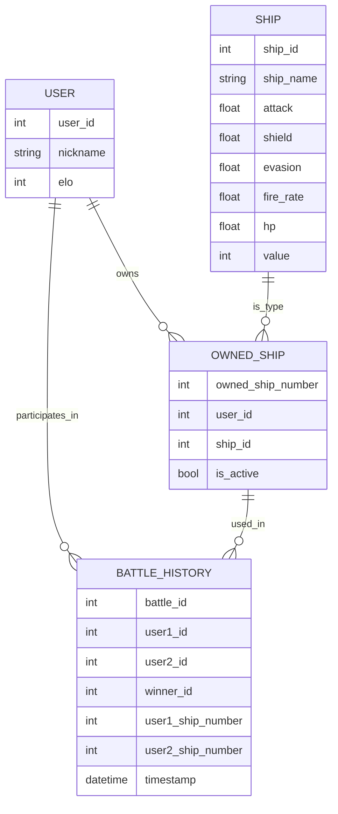
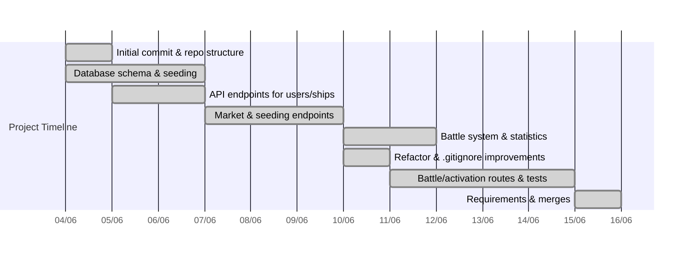

# 🚀 Space BattleShip

Space BattleShip is a learning project focused on backend development with FastAPI, SQLite database, and game logic integration for spaceship battles. The goal is to provide a robust API for managing users, ships, battles, and the market, serving as a foundation for future AI integrations and possible frontends.

---

## 🎯 Project Goals

- 🧩 **Backend Learning:** Practice with FastAPI, SQLAlchemy, and Pydantic.
- 🔗 **RESTful API:** Endpoints for managing game resources.
- 🤖 **AI-Ready Base:** Structure ready for future integration of intelligent agents.

---

## ✨ Features

- 🕹️ CRUD for users and ships
- ⚔️ Battle system between users
- 🛒 Ship market (buy/sell)
- 🌱 Data seeding endpoints
- 📡 Modular and extensible REST API

---

## 🛠️ Tech Stack

- **Backend:** Python 3.12+, FastAPI, SQLAlchemy, Pydantic
- **Database:** SQLite
- **Testing:** Pytest, FastAPI TestClient

---

## 🏁 Getting Started

### Prerequisites

- Python 3.12+
- (Recommended) Virtual environment: `python -m venv venv`

### Installation

```bash
# Clone the repository
git clone https://github.com/FilipePacheco73/Space-BattleShip.git
cd Space-BattleShip
# Create and activate a virtual environment (optional)
python -m venv venv
# On Windows:
venv\Scripts\activate
# Install dependencies
pip install -r requirements.txt
```

### Running the API

```bash
uvicorn app.main:app --reload
```

Access the interactive documentation at: [http://localhost:8000/docs](http://localhost:8000/docs)

---

## 🗂️ Project Structure

```
/Space-BattleShip
│
├── app/
│   ├── main.py              # FastAPI app entry point
│   ├── schemas.py           # Pydantic schemas
│   ├── crud/                # CRUD operations
│   ├── database/            # Database config and models
│   ├── routes/              # API routes/endpoints
│   └── test/                # Automated tests
├── requirements.txt         # Python dependencies
└── README.md
```

---

## 🗺️ Data Model Flowchart



---

## 🧩 Main Endpoints

- `POST /api/v1/seed/users` – Seed the database with initial users
- `POST /api/v1/seed/ships` – Seed the database with initial ships
- `GET /api/v1/users/` – List all users
- `GET /api/v1/ships/` – List all ships
- `POST /api/v1/market/buy/{user_id}/{ship_id}` – User buys a ship
- `POST /api/v1/market/sell/{user_id}/{owned_ship_number}` – User sells a ship
- `POST /api/v1/battle/battle` – Battle between two users

See the Swagger documentation for payload and response details.

---

## 🏆 Roadmap

- [x] CRUD for users and ships
- [x] Data seeding endpoints
- [x] Battle system
- [x] Ship market (buy/sell)
- [ ] AI agent interface
- [ ] Authentication and multiplayer

---

## 📈 Project History

- Initial backend and database structure
- Implementation of main endpoints (users, ships, battles, market)
- Automated tests with pytest
- Next steps: API refinement, AI integration, authentication

---

## 📊 Timeline (Commit History)



- Each bar represents a key phase or feature, based on actual commit dates and messages.
- For full commit details, see the [GitHub commit history](https://github.com/FilipePacheco73/Space-BattleShip/commits/main).

---

## 🤝 Contributing

Contributions are welcome! Open issues or submit pull requests to collaborate.

## 📜 License

MIT License

## 👤 Author

[FilipePacheco73](https://github.com/FilipePacheco73)

---

*This project is a playground for exploring backend, APIs, and artificial intelligence in a fun, competitive setting!*
